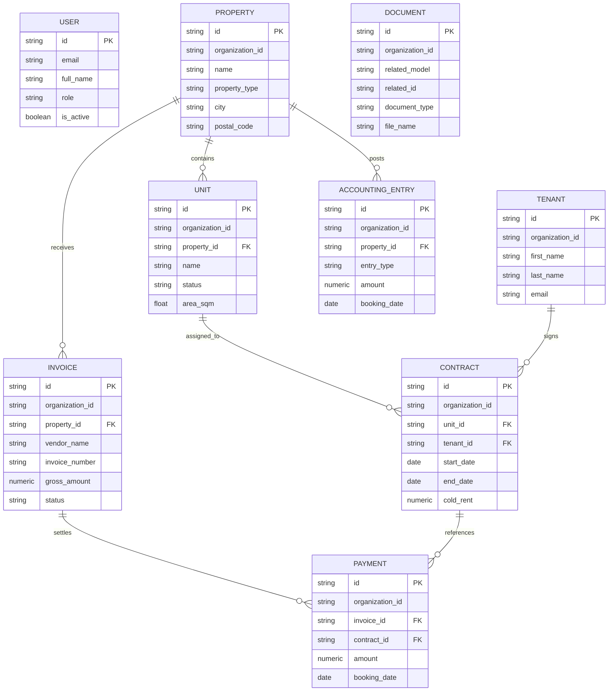

# Datenbankschema

## Überblick

Das initiale Schema bildet die Kernbereiche einer mandantenfähigen Immobilienverwaltungsplattform ab.

## ER-Diagramm

## Tabellen

### users

- Benutzerverwaltung für Eigentümer, Hausverwaltungen, Steuerberater, Mitarbeiter
- vorbereitet für JWT, OAuth2 und spätere SSO-Erweiterungen

### properties

- Stammdaten zu Immobilien
- vorbereitet für Wohn- und Gewerbeeinheiten sowie steuerrelevante Merkmale

### units

- einzelne vermietbare Einheiten
- Zuordnung zu genau einer Immobilie

### tenants

- Mieterstammdaten und Kontaktinformationen

### contracts

- Mietvertragsdaten inklusive Mietbeginn, Mietende, Kaltmiete und Nebenkostenvorauszahlung

### invoices

- Eingangsrechnungen inkl. Lieferant, Rechnungsnummer, Betrag und Status

### payments

- Bank- und Zahlungsereignisse zur Zuordnung auf Rechnungen und Verträge

### accounting_entries

- vorbereitete Buchungsstruktur für Reporting, DATEV-Exporte und Steuerlogik

### documents

- Metadaten für revisionssichere Dokumentenablage

## Multi-Tenant-Konzept

Alle fachlichen Tabellen enthalten ein `organization_id`-Feld als Grundlage für:

- logische Mandantentrennung
- Filterung auf Datenbank- und Service-Ebene
- spätere Sicherheitsregeln und Audits
